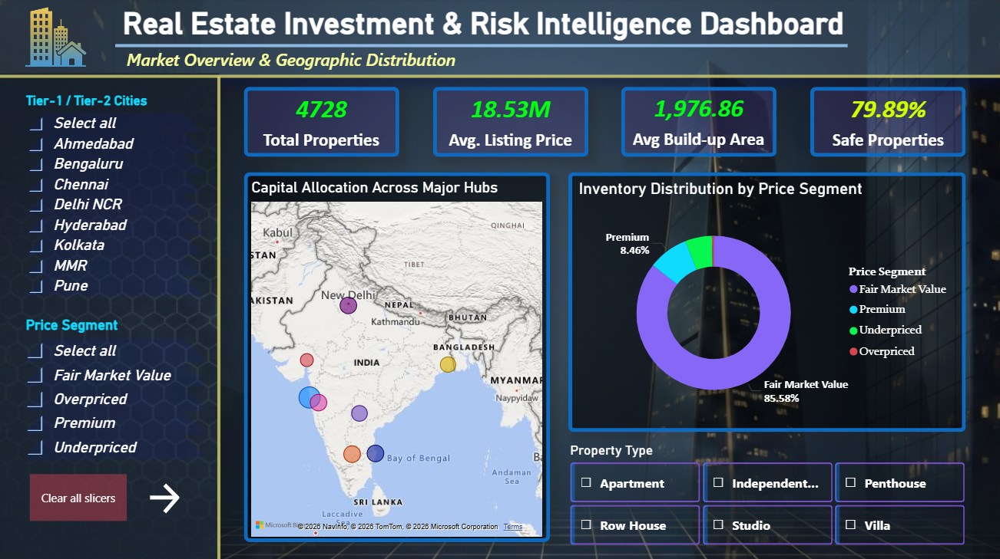
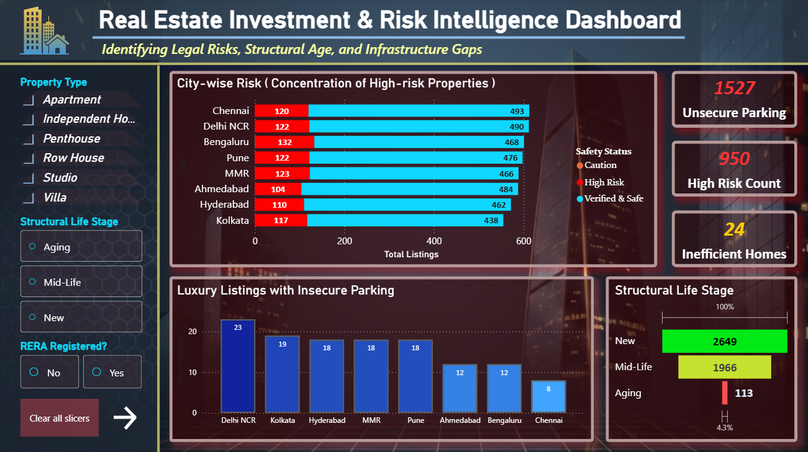
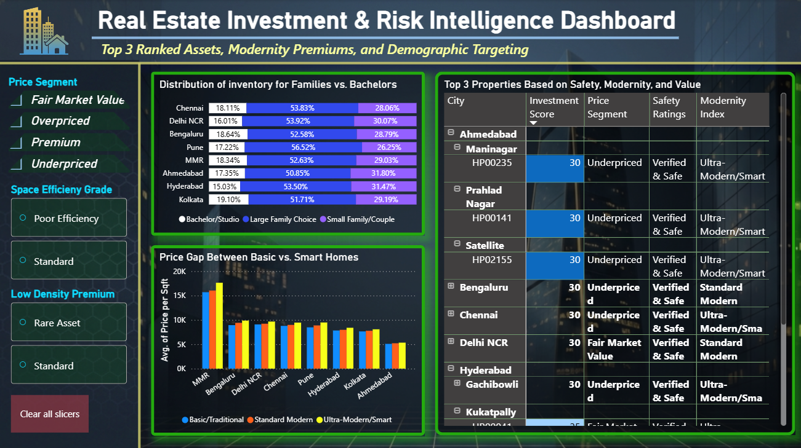

# 🏠 Real Estate Investment & Risk Intelligence Engine

An end-to-end data intelligence pipeline that transforms 4,500+ messy property listings into actionable investment strategies using SQL, Python, and Power BI.

---

## 📖 Table of Contents
1. <a href="#project-overview">Project Overview</a>
2. <a href="#problem-statement">Problem Statement</a>
3. <a href="#dataset-information">Dataset Information</a>
4. <a href="#tools-used">Tools Used</a>
5. <a href="#project-structure">Project Structure</a>
6. <a href="#technical-workflow">Technical Workflow</a>
    * <a href="#phase-1-engineering">Phase 1: Data & Feature Engineering</a>
    * <a href="#phase-2-sql">Phase 2: SQL Business Logic</a>
    * <a href="#phase-3-python">Phase 3: Python EDA & Diagnostic Analysis</a>
    * <a href="#phase-4-powerbi">Phase 4: Power BI Storytelling</a>
7. <a href="#key-business-insights">Key Business Insights</a>
8. <a href="#dashboard-previews">Dashboard Previews</a>
9. <a href="#how-to-run-this-project">How to Run This Project</a>
10. <a href="#final-recommendations">Final Recommendations</a>
11. <a href="#detailed-report">Detailed Findings Report</a>
12. <a href="#note-on-security">Note on Security</a>
13. <a href="#author--contact">Author & Contact</a>

---
<h2 id="project-overview">🎯 Project Overview</h2>

This project solves the "Information Asymmetry" in the Indian Real Estate market. By engineering custom metrics like **Safety Ratings** and **Modernity Indices**, I moved beyond simple price analysis to identify true market value and hidden risks.

---

<h2 id="problem-statement">❓ Problem Statement</h2>

This project aims to transform raw, fragmented real-estate data into an Investment Intelligence Engine. Instead of just looking at prices, we analyze risk, space efficiency, and demographic demand to help investors make data-backed decisions.

---

<h2 id="dataset-information">📊 Dataset Information</h2>

The data used in this project is sourced from Kaggle. It includes residential property listings across multiple Indian metropolitan regions for the year 2025.
* **Source:** [House Property Listings: 2025 Real Estate Data by Pratyush Puri](https://www.kaggle.com/datasets/pratyushpuri/pan-india-property-listings-2025-real-estate-data)
* **Scope:** 4,500+ Records, 8 Major Indian Cities.

---

<h2 id="tools-used">🛠️ Tools Used</h2>

- **Data Engineering:** Python (Pandas, NumPy), SQLAlchemy
- **Database:** MySQL (Relational Schema, Window Functions, Joins, Subqueries, CTEs)
- **Exploratory Data Analysis:** Python (Seaborn, Matplotlib)
- **Business Intelligence:** Power BI (DAX, Interactive Storytelling)

---

<h2 id="project-structure">📂 Project Structure</h2>

```
├── data/
├── logs/
|   └── ingestion_db.log                   
├── scripts/
│   └── ingestion_db.py            # Python script for SQL migration & logging
├── notebooks/
│   ├── data_and_feature_engineering.ipynb    # Cleaning & Feature Engineering
│   └── python_exploratory_data_analysis.ipynb     # Diagnostic & Visual Analysis
├── sql/
│   └── sql_exploratory_data_analysis.sql          # Business logic & 10 analytical questions
├── dashboard/
│   └── data_visualization.pbix   # Multi-page Power BI Dashboard
├── images/
│   |── dashboard1.png
|   |── dashboard2.png
|   └── dashboard3.png  
├── Indian Real Estate Investment & Risk Analytics Report.pdf          # Detailed analytical documentation
└── README.md                   # Project documentation
```

---

<h2 id="technical-workflow">🏗️ Technical Workflow</h2>

<h3 id="phase-1-engineering">Phase 1: Data & Feature Engineering</h3>

* **Ingestion:** Developed a Python script with `SQLAlchemy` and `logging` to migrate raw CSVs to MySQL using a standardized `snake_case` schema.
* **Data Wrangling:** Unified 4,500+ records using `UNION ALL` and handled duplicates via a **Composite Key Strategy** (City + Locality + Price + Area).
* **Smart Imputation:** 
    * Recovered missing City data via Locality cross-referencing.
    * Imputed Bathrooms/Parking using **Median/Mode logic** based on BHK and Building Type.
    * Resolved Latitude/Longitude using a **City-Centroid Imputation Strategy**.    
* **Feature Engineering:** Created 10+ custom features, including:
    * `safety_rating`: Proprietary score (Verified, Caution, High Risk) based on RERA, age, and land-overlap.
    * `price_deviation_pct`: Identifies "Bargains" (15% below locality average).
    * `structural_life_stage`: Classifies buildings (New, Mid-Life, Aging).
    * `low_density_premium`: Flags "Rare Assets" in high-demand urban zones.

<h3 id="phase-2-sql">Phase 2: SQL Business Logic</h3>

Implemented complex queries (CTEs, Window Functions, and Subqueries) in MySQL to solve 10 critical business questions, including:
* Ranking the **Top 3 Properties per City** based on Safety, Modernity, and Price.
* Calculating the **Price Premium** for "Ultra-Modern" features vs. "Basic" homes.
* Identifying **"Infrastructure Gaps"** (e.g., Luxury homes missing secure parking).

<h3 id="phase-3-python">Phase 3: Python EDA & Diagnostic Analysis</h3>

**Statistical Health Check:** Analyzed distributions and identified **230 luxury outliers** peaking at ₹22,000/sqft in Mumbai.
**Correlation Heatmap:** Discovered that **Location** and **Safety** have a higher impact on price than the number of amenities.
**Visual Validation:** Used `Seaborn` to confirm that building value drops sharply once hitting the "Aging" stage.

<h3 id="phase-4-powerbi">Phase 4: Power BI Storytelling</h3>

Built a 3-page interactive dashboard:
1.  **Market Overview:** Geospatial capital allocation and inventory segments.
2.  **Risk & Lifecycle:** Visualizing "High Risk" pockets, infrastructure gaps and structural life stages.
3.  **Investment Strategy:** Unique Top 3 property matrices and demographic targeting (Family vs. Bachelor).

---

<h2 id="key-business-insights">📈 Key Business Insights</h2>

- **Ahmedabad** emerged as the top value-for-money city with the highest "Safety-to-Price" ratio.
- Discovered an undersupply of **Bachelor/Studio units** in IT hubs, where inventory is 3x more geared toward large families.
- Identified a **20% High-Risk concentration** in real estate market.
- Discovered a significant **"Infrastructure Gap"** in Delhi NCR luxury homes (missing secure parking).
- Flagged premium properties that charge "Luxury" prices but offer high "dead space" (low carpet area efficiency).

---

<h2 id="dashboard-previews">📊 Dashboard Previews</h2>

### **Page 1: Market Overview**


### **Page 2: Risk & Lifecycle**


### **Page 3: Investment Strategy**


---

<h2 id="how-to-run-this-project">⚙️ How to Run This Project</h2>

1. **Clone the Repository**
Open your terminal or command prompt and run:
```bash
git clone [https://github.com/YOUR_USERNAME/YOUR_REPO_NAME.git](https://github.com/YOUR_USERNAME/YOUR_REPO_NAME.git)
cd YOUR_REPO_NAME
```
2. **Database Setup:**
   * Create a MySQL database named `estate`.
   * Update the connection string in `ingestion_db.py` with your username and password. Also update log_directory and target_folder.
3. **Environment:**
   * Install dependencies: `pip install pandas numpy sqlalchemy mysql-connector-python matplotlib seaborn`.
4. **Data Pipeline:**
   * Run `ingestion_db.py` to load data into SQL.
   * Execute `data_and_feature_engineering.ipynb` to process and clean the data.
5. **Analysis:**
   * Run `sql_exploratory_data_analysis.sql` in your MySQL Workbench to view business insights.
   * Execute `python_exploratory_data_analysis.ipynb` for statistical visualizations.
6. **Dashboard:**
   * Open `data_visualization.pbix` in **Power BI Desktop** to explore the interactive report.
   * **Note:** To view the Power BI dashboard with your data, go to **Transform Data > Data Source Settings** and update the server/database to match your local MySQL environment.

---

<h2 id="final-recommendations">🏁 Final Recommendations</h2>

* **For Investors:** Target "Rare Assets" (Low Density) in high-density cities like MMR for long-term appreciation.
* **For Developers:** Focus on building "Studio/Bachelor" apartments in IT hubs to fill the demographic supply gap.
* **For Buyers:** Prioritize RERA-registered "New" builds in Tier-2 cities for the best safety-to-price ratio.

---

<h2 id="detailed-report">📄 Detailed Findings Report</h2>

*For a detailed breakdown of the findings, please refer to the [Indian Real Estate Investment & Risk Analytics Report.pdf](Indian Real Estate Investment & Risk Analytics Report.pdf).*

---

<h2 id="note-on-security">🔒 Note on Security</h2>

Database credentials have been removed for security. Users can replicate the environment by substituting their own credentials in the connection strings.

---

<h2 id="author--contact">👤 Author & Contact</h2>

**Vaibhav Pal** <br>
Aspiring Data Analyst
* Email: vaibhav2021official@gmail.com
* LinkedIn: [linkedin.com/in/yourprofile](www.linkedin.com/in/vaibhav-pal-ab856b390)
* Portfolio: [Link to your website or GitHub Profile](https://github.com/vaibhavpal0226)

---
